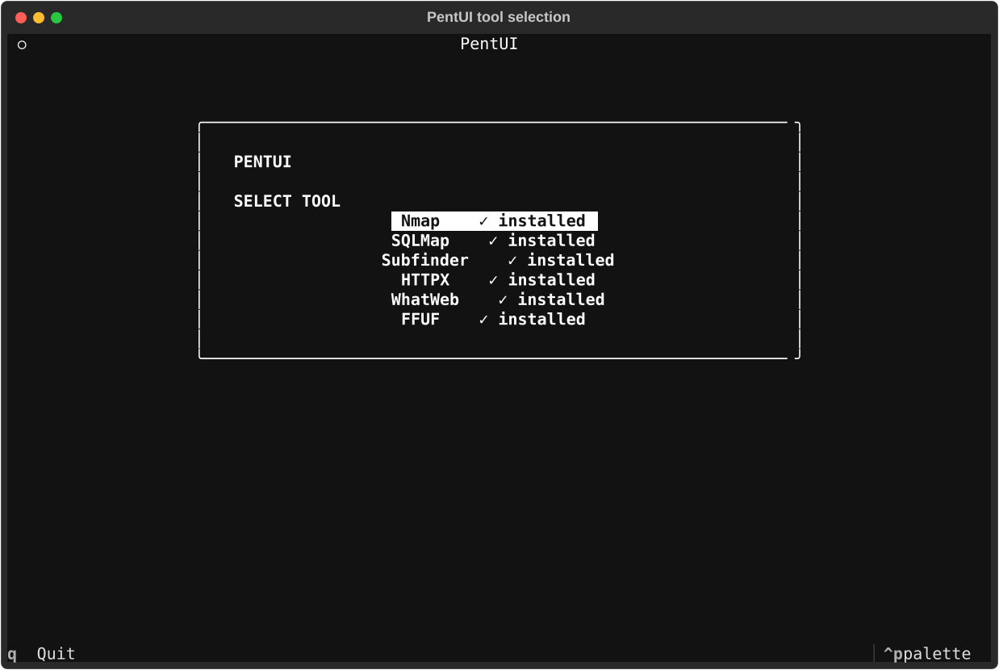

# PentUI

PentUI is a keyboard-first terminal interface for running security and web
reconnaissance tools you are authorized to use. It presents each tool's options
as explained, searchable controls, builds the command safely, shows a live
preview, and streams the command's output in the terminal.



*PentUI's live tool-selection screen, captured from the application on a system
where all supported executables are available on `PATH`.*

> **Use only on systems, applications, and networks you own or have explicit
> permission to assess.** PentUI does not grant permission or make a scan safe
> for an unauthorized target.

## What PentUI does

- Provides a single Textual terminal interface for supported command-line tools.
- Explains options in plain language instead of requiring every flag to be
  memorized.
- Filters options by flag, group, or description as you type.
- Keeps the command preview up to date before anything runs.
- Validates required fields, numeric fields, listed choices, targets, and the
  presence of the selected executable on `PATH`.
- Starts the selected command without a shell, using a structured argument list.
- Streams live output and provides a **Stop scan** control. Stopping returns to
  the current tool's configuration page with the chosen options still present.

## Supported tools

PentUI is an interface, not a replacement for the tools below. Install any tool
you want to use; the tool picker shows whether its executable is available.

| Tool | What it is used for in PentUI | Executable required |
| --- | --- | --- |
| [Nmap](https://nmap.org/) | Network discovery and port/service scanning | `nmap` |
| [sqlmap](https://sqlmap.org/) | Testing authorized web requests for SQL-injection issues | `sqlmap` |
| [Subfinder](https://github.com/projectdiscovery/subfinder) | Passive subdomain discovery | `subfinder` |
| [HTTPX](https://github.com/projectdiscovery/httpx) | HTTP probing and web-service information gathering | `httpx` |
| [WhatWeb](https://github.com/urbanadventurer/WhatWeb) | Identifying web technologies | `whatweb` |
| [FFUF](https://github.com/ffuf/ffuf) | Content, parameter, or virtual-host discovery using a supplied wordlist | `ffuf` |

Each tool's supported PentUI options live in [`tools/`](tools). The YAML files
hold the option flag, input type, group, placeholder, and explanation, keeping
tool-specific details out of the interface code.

## Requirements

### For PentUI itself

- Linux or another Unix-like environment with a terminal.
- Python **3.10 or newer** (`str | None` syntax is used by the application).
- `python3-venv` or your distribution's equivalent, so Python can create a
  virtual environment.
- Internet access the first time Python packages are installed.

Python dependencies are deliberately small and are listed in
[`requirements.txt`](requirements.txt):

| Dependency | Why it is needed |
| --- | --- |
| `textual` | The terminal user interface. |
| `PyYAML` | Reads the YAML tool definitions. |
| `pytest` | Runs the automated test suite. |

### For scans and probes

Install the external executable for every tool you plan to use. PentUI checks
for it on `PATH` before opening its configuration screen and validates it again
before running a command.

On Debian/Ubuntu-like systems, distribution packages commonly cover Nmap,
sqlmap, WhatWeb, and FFUF:

```bash
sudo apt update
sudo apt install nmap sqlmap whatweb ffuf
```

Subfinder and HTTPX are ProjectDiscovery tools. Their official installation
instructions use Go; after installing Go, the usual commands are:

```bash
go install -v github.com/projectdiscovery/subfinder/v2/cmd/subfinder@latest
go install -v github.com/projectdiscovery/httpx/cmd/httpx@latest
```

Make sure Go's bin directory is on your `PATH` before starting PentUI:

```bash
export PATH="$PATH:$(go env GOPATH)/bin"
```

Consult each project's linked documentation above for other operating systems,
package managers, and current installation options. Confirm everything PentUI
should use is visible with:

```bash
command -v nmap sqlmap subfinder httpx whatweb ffuf
```

## Install PentUI

### Option A: install the `pentui` launcher (recommended)

This launcher finds the project directory, creates `.venv` on its first run,
installs the Python dependencies, then starts PentUI. Clone the repository and
create a user-local command:

```bash
git clone https://github.com/masjim1387/PentUI.git
cd PentUI
chmod +x bin/pentui
mkdir -p "$HOME/.local/bin"
ln -sf "$(pwd)/bin/pentui" "$HOME/.local/bin/pentui"
```

Ensure `~/.local/bin` is in `PATH`. Add this to your shell configuration (such
as `~/.bashrc` or `~/.zshrc`) if `command -v pentui` does not find it:

```bash
export PATH="$HOME/.local/bin:$PATH"
```

Open a new terminal, or reload your shell configuration, then run PentUI from
any directory:

```bash
pentui
```

### Option B: run directly from a development environment

Use this approach when developing or when you do not want a launcher command:

```bash
git clone https://github.com/masjim1387/PentUI.git
cd PentUI
python3 -m venv .venv
source .venv/bin/activate
python -m pip install --upgrade pip
python -m pip install -r requirements.txt
python main.py
```

Later, reactivate the environment and start the app with:

```bash
cd /path/to/PentUI
source .venv/bin/activate
python main.py
```

## Using PentUI

1. Start `pentui` (or `python main.py` from the activated virtual environment).
2. Choose a tool marked **installed**. If it is marked **not installed**, install
   the executable or fix its `PATH` entry first.
3. Browse option groups or type into **Filter options** to narrow the list. You
   can search by a flag such as `-p`, a group such as `Output`, or any text from
   an option's explanation.
4. Press **Enter** or **Space** on a Boolean option to toggle it. Select an
   option requiring a value to open the value-entry dialog. Required fields and
   allowed choices are shown there.
5. Enter the required target or URL in the target field when the tool defines
   one. The command preview changes immediately.
6. Review the preview, then press `R` to validate and run. PentUI displays any
   missing executable, required input, integer, choice, or target error before
   it creates a process.
7. Read output on the running screen. Press `Q`, press `Esc`, or choose
   **Stop scan** to cancel a running command and return to its configuration.

### Keyboard controls

| Key | Where it works | Action |
| --- | --- | --- |
| Arrow keys / Tab | All screens | Move focus between controls. |
| `Enter` / `Space` | Tool configuration | Toggle an option or open its value dialog. |
| `R` | Tool configuration | Validate the current configuration and run it. |
| `Esc` | Configuration or output | Return to the previous screen. |
| `Q` | Tool selection/configuration | Quit PentUI. |
| `Q` | Running output | Stop the current command and return to configuration. |

The visible **Stop scan** button provides the same cancellation behavior for a
running command. Settings are maintained separately for each tool while PentUI
is open, so returning to the tool picker does not discard them.

## How commands are handled

PentUI builds a list of command arguments rather than concatenating text into a
shell command. For example, selected Nmap options become an internal list like:

```text
["nmap", "-sV", "-Pn", "-p", "80,443", "192.168.1.10"]
```

The displayed preview is only a readable representation of that list. At run
time, PentUI uses Python's `asyncio.create_subprocess_exec`, not a shell. This
avoids shell parsing and keeps the executable, each flag, and each user value as
separate arguments. It does not validate whether a target is authorized—that
remains your responsibility.

## Running tests

The test suite is small, fast, and does not launch Nmap or send network traffic.
It verifies the application logic that is safe to test without external tools:

- `tests/test_command_builder.py` checks structured argument construction,
  Boolean deselection, and that an empty value cannot leave a bare flag behind.
- `tests/test_validator.py` checks required targets, enumerated choices, and the
  missing-executable error path.
- `tests/test_tool_loader.py` checks that the Nmap and sqlmap YAML definitions
  load with expected required fields.

Run all tests from an activated virtual environment:

```bash
python -m pytest -q
```

Expected result at the time of writing:

```text
8 passed
```

To run one test file while iterating on a change:

```bash
python -m pytest -q tests/test_command_builder.py
```

## Project layout

```text
bin/pentui                 Portable launcher that manages .venv on first run
main.py                    Small entry point for the application
pentui/
  core/                    YAML models/loading, validation, command building, execution
  tui/                     Textual app, screens, dialogs, and terminal styles
tools/                     One YAML definition file for each supported tool
tests/                     Fast unit tests; no real scans are run
requirements.txt           Python runtime and test dependencies
```

## Updating PentUI

If you cloned with Git, update the source and Python packages like this:

```bash
cd /path/to/PentUI
git pull --ff-only
source .venv/bin/activate
python -m pip install -r requirements.txt
python -m pytest -q
```

The `pentui` launcher automatically creates a missing virtual environment, but
it does not reinstall packages in an existing one. Run the `pip install` command
above after updates that change `requirements.txt`.

## Troubleshooting

| Problem | What to check |
| --- | --- |
| `pentui: command not found` | Confirm `~/.local/bin` is on `PATH`, then run `command -v pentui`. |
| A tool says **not installed** | Run `command -v` followed by its executable name. Install it or add its install directory to `PATH`. |
| `No module named ...` | Activate `.venv`, then run `python -m pip install -r requirements.txt`. |
| The app does not start after an update | Reinstall requirements and run `python -m pytest -q` to identify a local dependency or code issue. |
| A scan will not run | Read the validation message; PentUI requires a usable executable and all required fields. |
| A stop action seems abrupt | Cancellation terminates the currently running child process and returns to the saved configuration. |

## Contributing and security

Contributions are welcome. Please read [CONTRIBUTING.md](CONTRIBUTING.md) for
the development workflow, testing expectation, and contribution boundaries.
For a vulnerability in PentUI itself, follow [SECURITY.md](SECURITY.md) rather
than posting exploit details publicly.

## Project status

PentUI currently supports Nmap, sqlmap, Subfinder, HTTPX, WhatWeb, and FFUF
through YAML-defined interfaces. The project is intentionally focused on a
clear, terminal-based workflow and can support additional YAML-defined tools in
the future without duplicating the core command-building and validation logic.
